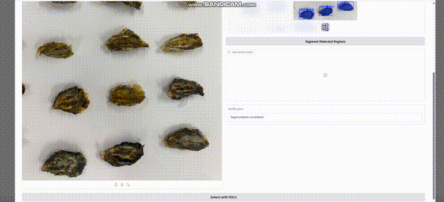

# 🦪 Oyster Segmentation Workflow

This repository demonstrates a deep learning-powered pipeline for **oyster instance segmentation and model-assisted annotation**. The workflow integrates YOLO-based models, SAHI for sliced inference, and DRCT for super-resolution enhancement.

---

## 🎬 Demo

The following demo illustrates the end-to-end process:

- ✅ **Input**: Raw oyster images collected from real-world aquaculture farms  
- ⚙️ **Processing**:  
  - YOLO object detection (YOLOv5/6/8/9)  
  - SAHI slicing for small object enhancement  
  - DRCT super-resolution for fine details  
- 🏷️ **Output**: Segmented oyster cutouts with annotation files (`.json` for LabelMe and `.txt` for YOLO)

> ▶️ **Click below to watch the segmentation pipeline in action**:

---

## 📜 Citation

This project extends our earlier work presented at the following conference:

> **Thi-Ngot Pham, Hee-Jung Lee, Jun-Ho Huh**, *Hybrid Approach to Oyster Dataset Creation: Integrating Deep Learning and Auto Labeling in Image Processing*, Proceedings of the **7th International Symposium on Signal Processing Systems (SSPS 2025)**, Ho Chi Minh City, Vietnam, May 16–18, 2025.

---

## 📬 Contact

For questions, dataset access, or collaboration inquiries, please contact the corresponding author.

